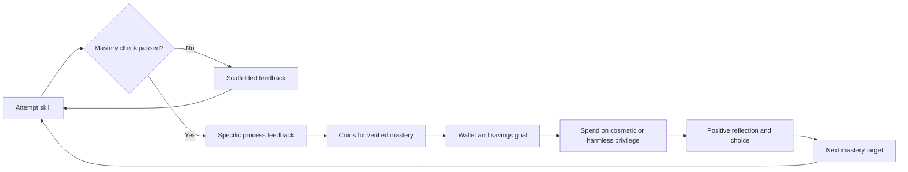

# Ethical Rewards for a Mastery-Based Child AI Tutor

## Executive summary

The safest effective reward system for a Prep–Year 7 AI tutor is not a commercial-style game economy. It is a conservative, mastery-linked token economy: one earned-only soft currency; one transparent store; no money in the child experience; no randomisation; no public rank by wealth; and rewards issued only for verified mastery, successful spaced review, and genuine gap-closing. That recommendation follows from a fairly consistent pattern in the literature: gamification in education shows small average gains in motivation and behaviour, but learning gains are heterogeneous; primary-school evidence is weaker than the hype; and points, badges, competitions and leaderboards are among the elements most often associated with negative effects, gaming, or irrelevance. citeturn1view0turn3view3turn2view2turn2view4turn4search1

The reward layer should therefore behave as **informational feedback plus harmless self-expression**, not as a pressure machine. The strongest synthesis is to reward quality signals rather than quantity signals: first verified mastery, due-review success, closure of a previously weak skill, and constructive persistence after correction. Pair coin awards with specific process praise, then let children spend on cosmetics, avatar personalisation, story/world unlocks, and small autonomy-granting privileges such as choosing a theme or elective challenge path. Do **not** let rewards buy easier work, extra answers, faster progress through curriculum, or any social status that can be mistaken for academic competence. Research grounded in self-determination theory is consistent with this: gamification tends to support autonomy and relatedness more than competence, while intrinsic motivation matters more for performance quality and incentives matter more for quantity. citeturn3view1turn17search0turn2view0turn23search0turn28view2

Legally and ethically, the baseline should be stricter than “what most games do”. Current child-data and consumer-protection guidance points in the same direction: best interests of the child; high privacy defaults; data minimisation; caution with profiling; no nudges that weaken privacy; strong caregiver visibility; and, where COPPA is in scope, verifiable parental consent. Recent enforcement and guidance also make the risk areas unusually clear: confusing interfaces, accidental charges, pressure to buy with virtual currencies, time-limited purchase prompts, and gambling-like random reward systems are exactly the patterns to keep out of a child tutoring product. citeturn33view3turn2view7turn13view0turn34view1turn8view4turn27view0turn28view0

## Assumptions and evidence base

This report assumes a child-directed or child-accessed at-home tutor, used primarily in a solo or caregiver-mediated setting, and assumes that the child reward system itself has **no direct real-money purchase path**. If you later add paid virtual currency, trading, gifting, ads, sponsorships, or external marketplaces, the legal and ethical risk profile changes materially, because the same design patterns begin to resemble the monetisation systems that regulators and child-rights bodies already treat as problematic. citeturn24view0turn27view0turn28view1turn8view4

The evidence base for a home AI tutor reward loop is still incomplete. The strongest research comes from broader education-gamification meta-analyses, classroom token-economy work, child development on delay of gratification, and official child-rights/privacy guidance. That means some recommendations here are high-confidence, especially the “do nots” around money pressure, dark patterns, privacy and social comparison. By contrast, the exact numbers for coin prices, earning cadence and store depth are **not** settled by strong child-specific trials in mastery-based tutoring. Where evidence is thinner, I have labelled the advice as a safe default or an experiment-worthy heuristic rather than a proven optimum. citeturn1view0turn3view3turn2view2turn4search3turn20view4

## Core incentive design principles

**Make rewards informational, not controlling.** The most defensible reward message is: “this shows what you learned and how you improved,” not “do this to get a prize.” Research on rewards and intrinsic motivation continues to support a distinction between informational feedback and controlling rewards. Expected tangible rewards can undermine intrinsic motivation when they feel controlling; verbal rewards and specific positive feedback can be helpful, especially when they communicate competence without coercion. The wording matters too: praising intelligence or fixed traits is more likely to undermine future motivation than praising effort, strategy and persistence. citeturn4view0turn2view0turn29search1turn29search14

**Reward mastery signals, never raw activity volume.** If a child can grind for coins by staying logged in, tapping quickly, requesting hints, or repeating already-mastered items, the economy will optimise the wrong thing. The evidence suggests that incentives are better at increasing quantity than quality, while intrinsic motivation is more predictive of quality performance. For a mastery tutor, that means coins should sit behind validated learning events: a concept pass, successful spaced retrieval, gap closure, transfer success, or a documented improvement in independence. Point systems designed by intuition can easily reinforce counterproductive behaviour; a mastery system should be explicit about what counts as a rewardable event and what does not. citeturn17search0turn20view0turn20view3turn2view4

**Use rewards to support autonomy and identity.** Rewards are most defensible when they create choice, ownership and harmless self-expression. That is why cosmetics, avatar customisation, story unlocks and optional thematic privileges are stronger default categories than performance-enhancing items. Meta-analytic work suggests gamification more reliably supports autonomy and relatedness than competence, and children’s avatar customisation research indicates that avatar-making can affect engagement, learning motivation, sense of control and identity exploration. In plain terms: let children make the space feel like theirs, but do not let the store determine what they can learn. citeturn3view1turn23search0turn9view1

**Prefer self-comparison and cooperation over competition.** Competition is not uniformly harmful, but the evidence is mixed, context dependent, and mostly older-learner heavy. In the broad gamification literature, competition combined with collaboration can outperform pure competition; in primary education specifically, gamification has been reported to negatively affect cooperation; and leaderboards, points and badges are frequently named among the elements associated with undesirable effects. For a child tutoring product, the default should therefore be private personal bests, collaborative household goals, or optional class/family quests with non-zero-sum targets. Public wealth, rank or cosmetic rarity displays are unnecessary risk. citeturn9view0turn9view4turn2view3turn2view4turn28view2

**Eliminate manipulative reward mechanics.** Scarcity prompts, countdown timers, exhortations to buy, confusing virtual currencies, accidental-purchase flows, loot boxes, flashy chance reveals, and interfaces designed to lengthen use are exactly the patterns children are vulnerable to and regulators have targeted. Official guidance and enforcement converge here. In a tutoring product, avoid not only real-money versions of those mechanics, but also their “soft” equivalents: fake scarcity, expiring streaks, rotating last-chance cosmetics, or pseudo-random prize wheels designed to pull children back in. citeturn24view0turn27view0turn8view4turn28view0turn2view7

## Age-band recommendations

The age bands below should be read as **developmental defaults**, not rigid rules. The main evidence underneath them is that younger children are more sensitive to reward immediacy, age-related delay tolerance improves over childhood, and rewards lose motivational value when pushed too far into the future. citeturn18search0turn18search2turn18search3turn19view0

| Age band | Recommended mechanics | Recommended reward types | Target earning cadence | Caregiver mediation |
|---|---|---|---|---|
| **Prep** | Immediate visible earn after verified micro-mastery; very short saving loops; one clear goal at a time; simple spend decisions | Single cosmetic items, pet reactions, sticker-book entries, small room decorations, story-theme choices | First spend opportunity in the same session or next day; longer saving goals should usually stay under about a week | Spend approval on by default; very small catalogue; no social features; caregiver sees all spend events |
| **Years 1–2** | Short mastery quests; concrete “finish this skill cluster” rewards; simple collecting; begin light saving | Cosmetic bundles, pet motions, theme packs, album pages, choose-next-world or choose-next-theme privileges | First spend in 1–3 days; medium goals in roughly 1–2 weeks | Caregiver visibility by default; optional approvals for medium/high-cost items; no public comparison |
| **Years 3–5** | Mastery quests plus spaced-review bonuses; collectible sets; private personal-best comparisons; optional family co-op goals | Richer cosmetics, sidekick skins, room sets, story chapter unlocks, maker-mode extras, elective challenge-zone access | First spend in 3–7 days; aspirational goals in 2–4 weeks | Caregiver can switch off social/collaborative features; spend summaries and savings goals visible |
| **Years 6–7** | Weekly savings goals; self-set targets within guardrails; more deliberate budgeting; private streaks without loss penalties; co-op over rank | Advanced cosmetic packs, profile frames, workspace customisation, creator tools, optional challenge permissions that do not change mastery standards | First spend in 5–10 days; larger goals in 2–4 weeks, occasionally longer only with explicit goal-setting and caregiver visibility | Threshold approvals for high-cost items; opt-in only for any shared/co-op experience; plain-language explanations of spend rules |

A useful practical rule is this: **the younger the learner, the shorter the gap between genuine mastery and the first meaningful spend**. The system should gradually expand saving horizons with age, but it should not ask a Prep child to hoard for weeks, and it should not train older pupils with casino-like instant jackpots either. citeturn18search0turn19view0turn24view0

## Reward catalogue and store design

A good reward store is transparent, finite, and clearly subordinate to learning. It should contain mostly **cosmetics and self-expression**, a smaller layer of **story or world unlocks**, and a very selective set of **harmless access privileges** that increase choice without creating academic advantage. Although mystery rewards can work in some tightly bounded preschool reinforcement studies, the safer digital default for a child tutor is **known rewards with known prices**, because broader online-safety and child-rights guidance treats randomised reward systems as gambling-like or financially risky. citeturn18search16turn28view0turn24view0

For pricing, the cleanest heuristic is to define **E** as the median coins a learner earns on a healthy study day for their age band. Then price catalogue items as multiples of **E** rather than arbitrary coin counts. That keeps the economy adaptable while preserving the same psychological pacing across ages. Because reward value falls when delayed, most catalogue depth should sit in the quick-win and mid-tier range, with only a small tail of aspirational items. citeturn19view0turn18search0turn18search2

| Catalogue category | Example items | What it supports | Suggested price band | Safe limits |
|---|---|---|---|---|
| **Quick-win cosmetics** | Hat, glasses, pet colour, notebook cover, celebratory emote | Immediate ownership and self-expression | **0.5E–1E** | No rarity tiers; always transparent; never random |
| **Cosmetic bundles** | Outfit set, tutor-theme pack, room decor bundle | Short-term saving and identity building | **1E–3E** | Avoid “premium” labels that imply status hierarchy |
| **Story or world unlocks** | New world skin, chapter vignette, collectible lore card | Narrative novelty and game fiction without academic distortion | **2E–4E** | Never gate core curriculum or remediation behind these |
| **Harmless access privileges** | Choose next elective challenge theme, rename pet, choose soundtrack/mascot voice | Autonomy and choice | **1E–3E** | Must not let children skip due review, hints, or hard content |
| **Creator or builder tools** | Room builder, portfolio frame, pet habitat, design studio | Longer-horizon goals for older bands | **4E–8E** | Best for Years 3–7; keep rare but reachable |
| **Aspirational prestige items** | Large room set, multi-item cosmetic collection, advanced studio pack | Deliberate saving and planning | **8E–12E** | Keep few in number; avoid FOMO and any public prestige display |

These categories are intentionally biased towards expression rather than power. That is because story/game fiction can help behavioural engagement, avatar customisation can support ownership and motivation, and “pay-to-win” style advantages introduce exactly the pressure, ambiguity and status distortion that child online-safety guidance warns about. citeturn9view1turn23search0turn28view2

The store itself should follow six design rules. First, use **one earned currency only**. Second, show **plain prices** with no exchange rates, bundles that force overbuying, or layered sub-currencies. Third, keep the catalogue **small enough to be legible**. Fourth, do not use countdown sales, “last chance”, or rotating child-facing scarcity. Fifth, keep social features off by default: no gifting, no trading, no purchase feeds, no “look what others bought”. Sixth, if you ever introduce any adult payment features elsewhere in the product, separate them completely from the child wallet and surface real-money prices clearly to the adult, not through another abstract currency layer. citeturn27view0turn28view1turn28view2turn24view0

Personalisation should tune **what** rewards a child sees, not **how hard the product tries to pull them back in**. It is legitimate to learn that one child prefers pet items while another prefers room decor, or that a younger child needs faster first-spend cycles than an older one. It is not legitimate to infer that a child is especially susceptible to urgency, regret or streak pressure and then intensify those prompts. In practice, adapt reward pacing only within age-band guardrails, and adapt category mix more than reward intensity. citeturn2view7turn33view3turn33view4turn32view4

On decay and expiry, the safest default is simple: **coins should not expire**. Do not confiscate balances for missed days, and do not break streaks in ways that produce loss aversion. If you need economic freshness, refresh the catalogue on a slow predictable cycle, keep archived items coming back on a known cadence, and avoid child-visible countdowns. Inflation should be managed by item design and catalogue tuning, not by punishing children’s saved balances. citeturn27view0turn24view0turn2view7

## Reinforcement schedules and sample algorithms

For this product, the most defensible schedule is **fixed, transparent, mastery-contingent reinforcement**, plus rare low-stakes delight moments that are not chance-based. The evidence points in a useful direction: rewards placed nearer the action are more motivating; immediate behaviour-contingent reinforcement can outperform delayed behaviour-independent reinforcement; unexpected rewards are less likely to undermine intrinsic motivation than expected controlling rewards; and gambling-like variable-ratio systems are precisely the patterns to avoid in child products. citeturn19view0turn20view3turn4view0turn2view0turn28view0

This loop deliberately keeps the reward downstream of learning: **the child does not do work to feed the store; the store responds to demonstrable learning**. That ordering matters, because the literature warns against reward systems that drift into activity farming or that start competing with the learning objective itself. citeturn19view0turn20view3turn2view2turn2view4

A practical schedule can be implemented as follows:

- **Every meaningful attempt:** give process-level feedback, but no coins unless a mastery event occurred. citeturn29search1turn2view0
- **First verified mastery of a skill:** fixed coin award. This is the core earn event. citeturn20view0turn20view3
- **Successful due spaced review:** smaller fixed coin award than first mastery, because retention matters but should not be infinitely farmable. citeturn20view3turn18search5
- **Gap closure:** larger award when a previously weak or failed skill is later mastered and retained. This aligns the economy with mastery learning rather than speed. citeturn20view0turn17search0
- **Milestone bundle:** predictable bundle when the child completes a concept set, unit, or review cycle. These should be announced in advance. citeturn19view0turn20view3
- **Surprise delight:** rare, low-value cosmetic gifts after major authentic milestones only; never chance-based; never tied to spending more time or revisiting the store. This is the only place I would use “surprise”, and even there, keep it sparse. citeturn4view0turn2view0

A simple award formula that is appropriate as a **safe default** is:

`award = round(E_target × event_weight × independence × novelty × spacing × challenge)`

Where:

- `E_target` is the target healthy daily earn for the age band.
- `event_weight` might be `0.30` for first mastery, `0.20` for due review, `0.40` for gap closure, and `0.60` for a retained unit-completion event.
- `independence` might be `1.0` with no hints, `0.75` with light hints, `0.5` with heavy hints.
- `novelty` is `1.0` for first mastery in the reward window, `0.5` for scheduled review, and `0` for unscheduled duplicate farming.
- `spacing` is `1.0` when review occurs in the due window, lower if the learner is early, and slightly higher for a documented comeback after an earlier miss.
- `challenge` modestly favours work at the learner’s edge rather than below-level repetition.

The anti-gaming rules matter as much as the formula. Give **zero coins** for time-on-task, log-ins, taps, low-quality retries, or repeated practice of already-mastered skills outside the scheduled review window. Allow **one first-mastery reward per skill**, **one review reward per spacing interval**, and no negative coin deductions for wrong answers or missed days. Adult proof-of-concept work suggests more sophisticated point optimisation is possible, but that evidence is not yet strong enough in primary-age tutoring to justify aggressive or loss-framed schemes. citeturn20view0turn20view3turn2view4

## Legal, privacy and ethical guardrails

Because jurisdiction is unspecified, the safest baseline is the child-rights and child-data posture reflected by the entity["organization","Information Commissioner's Office","uk data regulator"], the entity["organization","Office of the Australian Information Commissioner","australia privacy regulator"], the entity["organization","Federal Trade Commission","us consumer regulator"], entity["organization","UNICEF","un children agency"], the entity["organization","OECD","international policy body"], the entity["organization","European Commission","eu executive body"], and Australia’s entity["organization","eSafety Commissioner","australia online safety"]. Taken together, they imply a common standard: the child’s best interests should be a primary consideration; privacy should be high by default; data collection and retention should be minimal and explainable; child-facing systems should not use profiling or nudging to exploit vulnerabilities; and business models should not rely on pressure, opacity or gambling-like monetisation. One important current detail is that the Australian children’s privacy code is still being finalised, with completion due in December 2026, while the amended COPPA rule took effect in June 2025 with most compliance due by April 2026. citeturn33view3turn33view4turn14view3turn34view1turn34view3turn31view0turn32view1turn6view0turn6view1turn2view13

An ethical/legal checklist for the product team is therefore:

- **Run a documented child-rights and privacy impact assessment** before launch and whenever reward logic changes. Best-interests analysis should be rights-based, holistic, and informed by children’s and caregivers’ views rather than internal growth metrics alone. citeturn31view0turn32view0turn32view4
- **Set privacy to high by default.** Collect only the minimum reward data needed to operate the economy, do not share it by default, and publish a retention/deletion schedule. citeturn33view3turn33view4turn34view3turn34view5
- **If COPPA applies, obtain verifiable parental consent where required** using a method reasonably designed to verify the parent, and delete verification artefacts promptly where the rule or approved method requires it. citeturn34view1turn34view2turn34view4
- **Do not let children buy coins or items with money in child mode.** Avoid direct exhortations to purchase, time-limited offers, unclear virtual currency disclosures, and interfaces that could trigger unintended transactions. The enforcement action against entity["company","Epic Games","fortnite developer"] over entity["video_game","Fortnite","epic battle royale"] is a vivid illustration of what not to reproduce. citeturn27view0turn8view4turn28view1
- **Ban randomised rewards, loot boxes and flashy chance reveals.** They are treated in official guidance as gambling-like or materially risky for children. citeturn28view0turn24view0turn10search5
- **Keep academic fairness absolute.** No pay-to-win analogue: no skipping levels, buying extra answer reveals, or purchasing easier progress. citeturn28view2
- **Turn social spending features off by default.** No gifting, no trading, no public inventory, and no status feeds based on what a child owns. Social pressure around cosmetics and gifting is already documented as a risk. citeturn28view2
- **Give caregivers controls over content categories and reward features, not only timer caps.** Current evidence suggests content and site rules may be more useful than blunt time restrictions alone for problematic use. citeturn12view1turn12view2
- **Make the reward system optional and explainable.** Offer a no-store or “feedback only” mode, show plain-language earning rules, and log all economy changes for auditability. This is a safe default where direct evidence is limited, but it is strongly aligned with transparency and best-interests principles. citeturn33view3turn31view0turn6view0

## Measurement plan and open questions

Because gamification can improve engagement without reliably improving learning, and because child-focused services must privilege wellbeing over stickiness, the measurement hierarchy should be: **learning first, healthy persistence second, economy health third, retention fourth**. Raw session length, total daily minutes, or compulsive return patterns are not success metrics for this product. citeturn2view2turn2view3turn9view2turn12view1turn24view0

### KPIs

Use a balanced scorecard rather than a single retention metric.

- **Learning outcomes:** mastery velocity; time to close known gaps; spaced-review success rate; 7/14/30-day retention; transfer-item accuracy; independence from hints over time.
- **Healthy persistence:** return after setback; proportion of children who re-attempt a failed skill constructively; child-reported pride, pressure and control using age-appropriate scales.
- **Economy health:** time to first earn; time to first spend; hoarding rate; regret/undo requests; spend dispersion by reward category; percentage of rewards purchased but never used.
- **Caregiver trust:** approval usage; complaints; number of override requests; conflict around stopping; requests to disable rewards.
- **Safety and compliance:** privacy incidents; unsupervised-feature access; any accidental-purchase-like events; any evidence of reward farming.

If one metric should dominate product reviews, it is **retained mastery per healthy study day**, not session duration.

### Suggested A/B tests

Only test **safe variants**. Do not run experiments on loot boxes, countdown timers, public leaderboards, coin loss, or child-facing purchase prompts.

| Test | Comparison | Primary success criterion | Kill criteria |
|---|---|---|---|
| **Starter attainability** | First low-tier item reachable in 1 day vs 3 days | Better early persistence without worse mastery quality | More spam attempts, lower transfer accuracy, higher pressure scores |
| **Reward category mix** | Cosmetics only vs cosmetics plus harmless access privileges | Better autonomy/control ratings and stable learning outcomes | Any increase in skipping hard work or reduced review completion |
| **Milestone delight** | Deterministic midpoint rewards vs deterministic rewards plus rare surprise cosmetic gifts | Higher enjoyment with no rise in compulsive checking | More store-refresh behaviour or frustration when surprise absent |
| **Private progress vs co-op** | Personal-best view vs family/cohort cooperative goal | Better persistence and belonging without status pressure | Increased comparison stress or requests for ranking |
| **Personalised catalogue** | Child-selected interests vs generic store | Faster, healthier spend and lower hoarding without higher usage pressure | Narrowing into compulsive favourite loops or caregiver concern |
| **Store density** | Small catalogue vs larger catalogue within same price structure | Better spend clarity and lower regret | Decision paralysis, regret, or reduced learning focus |

For each experiment, pre-register one learning hypothesis, one wellbeing hypothesis, and one abuse/gaming hypothesis. Review outcomes after at least two full mastery-and-review cycles, not after a novelty week.

### Open questions

Three evidence gaps matter. First, there is still no strong child-specific evidence for the **optimal magnitude** of virtual rewards in an at-home mastery tutor. Second, the literature on gamification is still disproportionately drawn from older learners, higher education, or general educational settings, whereas your use case is younger, home-based, and AI-mediated. Third, more principled point optimisation methods look promising, but much of the direct evidence is proof-of-concept work outside this exact population and context. The practical implication is not paralysis; it is restraint. Start with transparent, low-pressure defaults, and let your experiments tune pacing at the margins rather than the moral structure of the system. citeturn2view2turn4search3turn20view4turn20view3