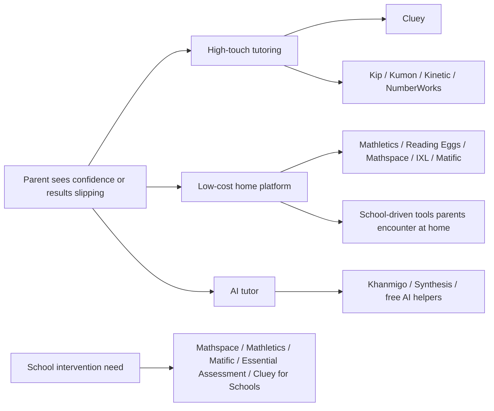
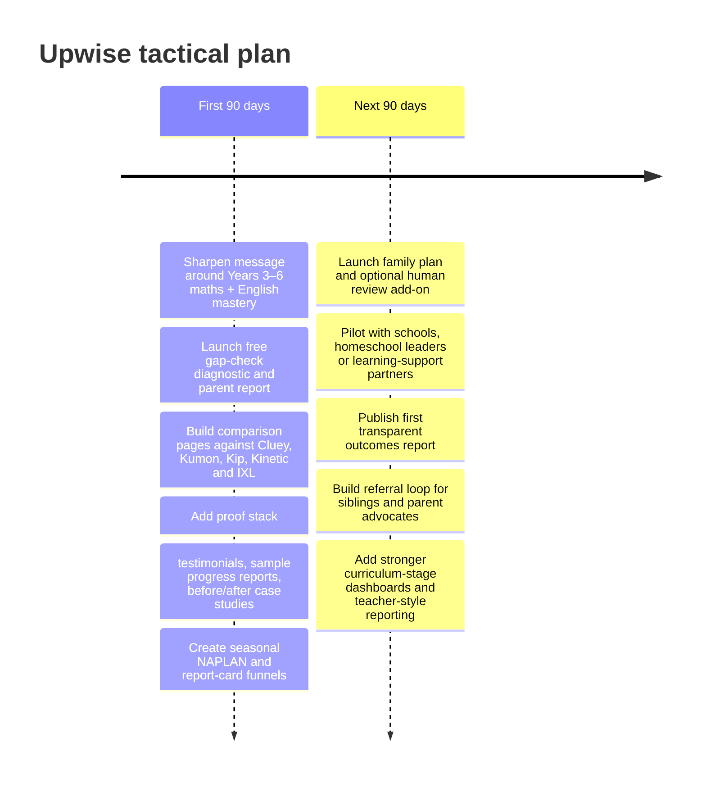

# Upwise competitor landscape for Australian primary maths and English

Scope: this report assesses the competitors most likely to win the same parent budget, school-intervention need, or home-learning time as Upwise in Australia, current as at 24 April 2026. I have prioritised competitor product pages, pricing pages, investor disclosures, official research/effectiveness pages, and Australian education sources.

## Executive summary

The market that matters for Upwise is not one single category. It is a stack of four overlapping ones: live online tutoring and tutoring centres, mastery-style worksheet/intervention brands, school-to-home learning platforms, and new AI-native learning tools. The most material Australian tutoring competitors are Cluey, Kip McGrath, Kinetic Education, Kumon, NumberWorks’nWords and the rapidly expanding Success Tutoring. The most important platform competitors are Mathletics, Reading Eggs/Mathseeds, Mathspace, Matific, IXL and school-first tools such as Essential Assessment. The most relevant AI entrants are Khanmigo and Synthesis Tutor. citeturn25search3turn7view0turn10view0turn8view0turn9view0turn35search3turn15view1turn15view5turn11search2turn18view0turn21search8turn34view0turn27search0turn29view0

The strongest overall threats to Upwise are Cluey, Kinetic Education, Kip McGrath, Kumon, Reading Eggs/Mathseeds and IXL. Cluey is the clearest premium digital analogue because it combines Australian curriculum mapping, online delivery, parent reporting, session recordings, primary maths and English, and school partnerships. Kinetic is the closest affordability-led online analogue because it offers curriculum-aligned maths and English with tutor support from just A$29 per week for a family. Kip and Kumon are still the highest-trust legacy interventions in parents’ minds, while Reading Eggs/Mathseeds and IXL are strong lower-cost platform substitutes that can satisfy the “my child needs extra practice at home” use case without a tutor. citeturn4view2turn25search3turn25search6turn10view0turn10view1turn7view0turn7view2turn8view1turn8view2turn15view5turn31search7turn21search16turn19search0

The most important strategic insight is that there is still a clear white space. Very few competitors combine all of the following in one product: Australian primary curriculum alignment, both maths and English, mastery-style gap diagnosis, daily adaptive learning, parent-visible progress, family-friendly subscription pricing, and low operational complexity. Most tutoring brands solve the problem with expensive human service; most platforms solve only one subject or are school-first; most AI entrants are not yet strongly localised to Australian curriculum and parent expectations. That is the opening for Upwise. citeturn4view2turn7view0turn8view2turn15view5turn44search10turn11search1turn18view2turn21search16turn27search0turn29view0

The tactical conclusion is straightforward. Upwise should not try to out-Cluey on premium tutoring, out-Kumon on brand heritage, or out-Reading Eggs on pre-reader entertainment. It should instead own the wedge that is still under-served: **Years 3–6, Australian maths and English, mastery-first, parent-visible, cheaper than one tutoring session per month, and strong enough to be used for catch-up, keep-up and NAPLAN readiness**. citeturn4view3turn8view1turn10view1turn31search7turn15view5turn44search1turn41search0turn41search2

## Market structure and why this category exists now

Demand conditions remain favourable. ACARA said the 2025 NAPLAN results were broadly stable overall, but also noted that one in 10 students still needed additional support. At the same time, the Grattan Institute’s *The Maths Guarantee* argues that roughly one in three Australian students fail to achieve proficiency in maths. In practice, that creates a large, durable market for products that can identify hidden gaps, provide structured catch-up, and show clear progress to parents. citeturn41search0turn41search3turn41search2

The structure of the market explains why parents keep buying different things for the same underlying problem. Tutoring brands sell reassurance, individual attention and diagnosis. Worksheet/mastery brands sell discipline and habit. School-home platforms sell scale, data and convenience. AI-native entrants sell personalisation and lower marginal cost. Upwise’s opportunity is to package the strongest elements of each without inheriting the full cost base of human tutoring or the narrowness of a single-subject practice tool. That reading is supported by the way leading players position themselves: free assessments and qualified teachers for Kip, continuous assessment and reports for Cluey, self-learning and daily worksheets for Kumon, school/home dual use for Mathletics and Mathspace, and low-cost AI tutoring for Khanmigo and Synthesis. citeturn7view0turn25search0turn8view2turn15view1turn11search2turn2search16turn29view0

For Upwise, the most attractive buying job is not “find me a tutor”. It is “help my child close gaps in maths and English, at home, with proof that it is working, without tutoring-level cost or hassle”. That buying job is large precisely because the market is fragmented. citeturn25search3turn34view1turn15view5turn44search1turn11search3turn21search16

## Comparative table

| Competitor | Core offer and model | Indicative price | Primary overlap | Delivery mode | Alignment and outcomes | GTM and trust signals | Threat to Upwise | Sources |
|---|---|---:|---|---|---|---|---|---|
| Cluey | Online tutoring platform with primary maths, English and NAPLAN; tailored programme; also sells into schools | Tailored quote; no long-term contract; trial flow | Years 2–6 maths + English | 1:1 and small group, live online | Australian Curriculum-mapped; “continuous assessment”; 85% of parents say child more confident | 33,000+ Australian students; session recordings; progress reports; UNSW and Harding Miller partnerships; schools channel | **Very high** | citeturn4view1turn4view2turn25search3turn25search6turn26search1 |
| Kip McGrath | Teacher-led tutoring franchise/intervention business | **A$74/session**; free assessment | Strong in primary maths + English | In-centre or online; 60-minute weekly sessions | Curriculum topics covered; homework + progress reports | 140+ Australia locations; 500+ global centres; ATA link; qualified teachers | **Very high** | citeturn7view0turn7view1turn7view2turn4view3 |
| Kumon | Mastery/worksheet intervention with strong brand equity | **A$160/month per subject** + **A$100 enrolment** | Maths + English, particularly foundational catch-up and extension | Centre-based plus home study; daily worksheets | Individualised self-learning model; not explicitly NAPLAN-led | Deep trust, long heritage, achievement tests and honour rolls | **High** | citeturn8view0turn8view1turn8view2turn8view3 |
| Kinetic Education | Online maths and English with tutor support and adaptive lesson plans | **From A$29/week for the family** | Very strong K–6 overlap | Platform + live tutor support + weekly parent updates | Follows Australian curriculum; assessment-led plans; rewards | 100,000+ families helped; 96% satisfaction; ProductReview emphasis | **Very high** | citeturn10view0turn10view1turn10view2 |
| NumberWorks’nWords | In-centre tutoring using software + tutor explanation + books/worksheets | **A$71/primary lesson** | Strong primary maths + English | Small classes with 1:1 tutor support, mostly in-centre | Curriculum-based; free assessment; progress reports | 120,000+ lessons each term; confidence- and results-led proof | **High** | citeturn9view0turn9view1turn9view2turn9view3 |
| Success Tutoring | Membership-based tutoring franchise with study hubs and app booking; emerging AI layer | Weekly membership; centre-specific; no lock-in contracts | Primary maths + English, homework and NAPLAN | Class + 1:1 in-centre; app support | Australian Curriculum based; personalised plans | Fast-growing Australian franchise; many campuses; free AI tutor “Successbot” | **Medium to high** | citeturn35search3turn35search4turn35search15turn35search1turn36search1turn35search14 |
| Reading Eggs / Mathseeds | Home subscription suite for reading plus early maths | **A$13.99/month** or **A$109.99/year**; up to 4 children; 30-day trial | Strong for early primary; weaker in upper-primary maths mastery | Self-paced platform/app | Science of Reading positioning; ESSA; school and home use; NAPLAN reading proof for Eggspress | 20 million users; kidSAFE; ad-free; research-led trust | **High** | citeturn31search7turn15view5turn15view4turn43search2turn43search6 |
| Mathletics | School-and-home maths platform from entity["company","3P Learning","edtech australia"] | Home subscription exists but live AU pricing is portal-gated in this web pass; free trials prominent | Strong maths substitute, no English | Self-paced platform for school and home | Australian curriculum aligned; NAPLAN numeracy claims; reporting and rewards | 3.5m+ students globally; 200,000+ teachers; 3P investor scale | **Medium to high** | citeturn15view1turn44search1turn44search7turn44search9turn44search10turn14search5 |
| Mathspace | Maths-only adaptive platform, strong school presence, some free parent/student access | Free learner account; school/custom and textbook pricing beyond that | Strong maths-only substitute, especially Year 3+ | Self-paced platform for schools, learners and parents | Australian Curriculum and state alignment; diagnostic check-ins; 53%/66% proficiency study | Eddie Woo partnership; 725,671 global learners shown on site | **Medium** | citeturn11search1turn11search2turn11search3turn13search2turn13search6 |
| IXL | Broad international practice platform for maths, English and science | Family subscription exists; exact AU live price not cleanly extractable in captured page | Strong breadth substitute, especially for practice-heavy parents | Self-paced platform | Australian Curriculum, NSW and WA skill plans; diagnostic + analytics; efficacy studies | Huge scale; extensive skill coverage; strong recommendations engine | **High** | citeturn19search0turn21search16turn21search12turn21search10turn22search0turn22search1 |
| Matific | Gamified maths platform for home, schools and governments | Paid home subscription; exact live AU amount not cleanly extractable in captured page | Strong maths-only substitute, especially younger primary | Self-paced platform; teacher dashboard | AI personalisation; 34% improvement claim; ISO27001 and WCAG 2.1 AA | Millions of learners; 15,000+ 5-star reviews; UNICEF and government partnerships | **Medium** | citeturn18view0turn18view2turn18view3 |
| entity["company","Essential Assessment","assessment platform australia"] | School-first maths and English assessment, reporting and follow-on learning activities | School pricing / book a meeting | Indirect but important school-channel threat | Teacher-led assessment + student practice | Thousands of curriculum-aligned assessments; strong reporting; online and paper | Strong Australian teacher use cases, especially intervention and diagnostics | **Medium** | citeturn34view0turn34view1turn24search10turn24search18 |
| entity["organization","Khan Academy","education nonprofit"] / Khanmigo | Free content library plus paid AI tutor and parent tools | **US$4/month** or **US$44/year** covering up to 10 learners | Strong free/cheap substitute, weaker on AU localisation | Self-paced content + AI tutor | Broad standards-aligned content; parent chat-history controls; 4-star Common Sense rating | Non-profit trust, huge distribution, very low price | **Medium** | citeturn27search0turn27search1turn2search16turn27search3turn30search1 |
| Synthesis Tutor by entity["company","Synthesis School","ai math tutor"] | AI-native K–5 maths tutor | Promo pricing shown as **US$25/month billed annually** for one child, or **US$119/year** family under sale offer | Relevant AI watchlist, but maths-only and not AU-aligned | Self-paced AI tutor on iPad/desktop | K–5 maths; continuous micro-assessments; progress emails | SpaceX-origin story; 25,000+ families; strong testimonials but less local trust | **Watchlist** | citeturn29view0turn29view1 |

## Ranked threat leaderboard

**Cluey** remains the most serious single competitor. It is the closest premium digital substitute for Upwise because it spans primary maths and English, uses online delivery, maps to the Australian curriculum, provides regular reporting and recordings, and now has a schools arm as well as a direct-to-parent offer. Its weakness is price opacity and the operational heaviness of a tutoring business, but those are precisely the areas where Upwise can undercut it while borrowing its strongest messages: clear diagnosis, confidence building and visible progress. citeturn4view2turn25search3turn25search6turn26search1

**Kinetic Education** deserves to move up the starting list because the overlap is unusually high: primary maths and English, online delivery, assessment-driven personalisation, weekly parent updates, rewards, and a lower advertised starting price than traditional tutoring. Its weakness is that its model still depends on live tutor support and a service layer; Upwise should position against that by arguing for daily frequency and lower friction, not by trying to look “more premium”. citeturn10view0turn10view1turn10view2

**Kip McGrath** is still formidable because many parents trust it before they trust an app. It has qualified teachers, a free assessment, strong local footprint, in-centre and online flexibility, weekly routines and high recall. The downside is cost, subject separation, and less obvious software leverage than a true AI-first mastery product. Upwise should treat Kip as a trust benchmark, not a product template. citeturn7view0turn7view1turn7view2turn4view3

**Kumon** is strategically important because it owns the word “mastery” in many parents’ heads, even when the underlying experience is worksheets and habit rather than adaptive software. That makes Kumon an ideological competitor as much as a commercial one. Upwise should not attack Kumon head-on; it should present itself as “the mastery philosophy, updated for Australian families who want visibility, adaptivity and less grind”. citeturn8view1turn8view2turn8view3

**Reading Eggs / Mathseeds** is a larger threat than many tutoring founders initially assume, especially in Foundation to Year 3. It is cheap, trusted, literacy-credible, kid-safe, multi-child friendly, and already accepted in homes and schools. The opportunity for Upwise is to avoid competing where Reading Eggs is strongest. Instead, the better wedge is Years 3–6, where the need shifts from “learn to read” to “close hidden curriculum gaps in reading comprehension, writing and maths”. citeturn15view5turn31search7turn43search2turn43search6

**IXL** is the strongest global breadth player. It covers maths and English, offers diagnostic and analytics, aligns to Australian curriculum frameworks, and has credible efficacy work. Its weaknesses in Australia are localisation, emotional brand fit, and a practice-heavy experience that can feel like “lots of questions” rather than a guided recovery plan. Upwise should position as the more Australian, more motivating and more explicitly mastery-led alternative. citeturn21search16turn21search12turn21search10turn22search0turn22search1

**Mathletics** is dangerous because of distribution, not because it fully matches the Upwise proposition. Schools know it, teachers know it, children know it, and 3P Learning continues to invest in the portfolio. But it is maths-only, and in many homes it functions as extension or school reinforcement rather than a dual-subject intervention system. Upwise should treat Mathletics as a maths-channel threat and use English as one of its key differentiators. citeturn15view1turn44search1turn44search7turn14search5

**Mathspace** is a serious maths-only threat, especially for older primary and lower-secondary users and for school-led adoption. Its adaptive engine, curriculum alignment, recommendations and outcomes messaging are strong. But the product is still fundamentally maths-only and much more naturally teacher- or school-anchored than a family-first “fix the gaps in both core subjects” offer. citeturn11search1turn11search2turn11search3turn13search6

**NumberWorks’nWords** is less national in mindshare than Kip or Kumon, but its overlap with Upwise is still material because it combines maths and English, free assessment, tailored plans, lessons after school and a credible outcomes story. Its main weakness is physical and operational friction. Upwise should specifically target parents who want the intentionality of tutoring without handing over calendar control and centre travel time. citeturn9view0turn9view1turn9view3

**Matific** is best viewed as an important maths-only flank competitor, especially for younger primary students and for school/system deals. It has strong gamification, AI personalisation, government and NGO partnerships, and explicit inclusion/security credentials. But it does not solve English, and its brand narrative is more “engaging maths app” than “Australian two-subject mastery intervention”. citeturn18view0turn18view2turn18view3

The **watchlist** is clear. **Khanmigo / Khan Academy** is the most dangerous low-price AI substitute if it becomes better localised for Australian primary parents. **Synthesis Tutor** is the most interesting AI-native maths threat, but for now it is more of a premium early-adopter product than a mainstream Australian substitute. **Success Tutoring** is the local franchise to watch because it is adding AI, expanding campuses and marketing hard to families. **Essential Assessment** matters because it can reduce consumer demand by helping schools diagnose and target earlier. citeturn27search1turn2search16turn29view0turn35search14turn36search1turn34view1

## Positioning opportunities for Upwise

The most attractive category wedge is **Years 3–6**. That is where the market fragments. Reading Eggs/Mathseeds is strongest in earlier literacy and early numeracy; Mathletics, Mathspace and Matific are maths-first; tutoring brands are expensive but trusted; and AI tools are still thin on Australian curriculum framing. Upwise can therefore occupy a very specific territory: **“the Australian primary maths-and-English mastery platform for hidden gaps, confidence and catch-up.”** citeturn15view5turn15view4turn44search10turn11search1turn18view0turn4view2turn10view1

A second opportunity is proof. Most competitors rely on some mix of testimonials, vendor-hosted studies, platform statistics and trust badges. That works, but it also leaves room for a cleaner evidence story. If Upwise can publish transparent pre/post mastery data by strand, stage and usage cohort in an Australian sample, it can look more rigorous than tutoring brands that mainly show reviews and more relevant than global platforms that cite international studies. citeturn26search1turn10view0turn43search6turn44search1turn22search1

A third opportunity is **parent clarity**. The most visible competitors promise help, but few communicate a simple “what happens next?” journey. Cluey and Kip sell assessments and programmes; Kumon sells routine and self-learning; Mathspace, Mathletics and IXL sell practice and data. Upwise can own a clearer narrative: **assess gaps, assign daily mastery work, explain mistakes, show weekly progress, and move the child forward when mastery is demonstrated**. That is both a product promise and a conversion advantage. citeturn25search0turn25search6turn7view0turn8view2turn11search2turn44search9turn21search16

### Growth channels

The best-growth channels are the ones already proven by competitors’ behaviour. First, own comparison and intent-led search around “Cluey alternative”, “Kumon alternative”, “best maths app Australia”, “NAPLAN help Year 3/5”, and “child falling behind in maths/English”, because competing brands lean heavily on local landing pages, area pages, school-year pages and free-assessment funnels. Second, build parent referral and sibling loops, because many rival offers are naturally family- or multi-child oriented. Third, create a school-adjacent channel via intervention coordinators, learning-support teams, homeschool communities and allied professionals who already work with anxious families. Fourth, build trust in public review environments because Kinetic, Cluey and Success Tutoring all lean visibly on review and testimonial signals. citeturn25search3turn25search13turn7view0turn10view2turn31search7turn35search1turn34view1

### Pricing and packaging recommendations

The market leaves a very useful pricing ladder. Kip is A$74 per session, Kumon is A$160 per subject per month, Kinetic starts from A$29 per week for the family, and Reading Eggs is A$13.99 per month for up to four children. Khanmigo is ultra-cheap in US dollars, while Synthesis sits much higher as a premium AI tutor. That means Upwise should **stay decisively below tutoring economics**, but **above commodity app pricing**, so that it reads as a real intervention rather than an entertainment subscription. citeturn4view3turn8view1turn10view1turn31search7turn2search16turn29view1

A sensible packaging structure would look like this:

| Package | Suggested price band | What it should include | Why it works |
|---|---:|---|---|
| Starter Maths **or** English | **A$24–29/month** | One child, one subject, diagnostic, daily tasks, weekly parent summary | Low-friction entry point against low-cost apps |
| Core Mastery | **A$39–49/month** | One child, maths + English, stronger reporting, NAPLAN-ready pathways | The flagship positioning sweet spot |
| Family | **A$59–79/month** | Up to 3 children, both subjects, family dashboard | Strong answer to Reading Eggs-style multi-child value |
| Seasonal booster | **A$39–59 one-off** | 4–6 week NAPLAN or report-card recovery sprint | Event-based acquisition and reactivation |
| Human add-on | **A$19–29/month** | Monthly coach review or parent consult | Lets Upwise borrow tutoring trust without becoming a tutoring business |

The strategic point is more important than the exact number. Upwise should anchor against the cost of even a single tutoring session, not against the cheapest app. That lets you say, credibly: **“For less than one tutoring session, you get a month of structured maths-and-English mastery.”** citeturn4view3turn10view1turn31search7

## Tactical plan

The next six months should focus less on feature sprawl and more on sharper category ownership.

In the first 90 days, Upwise should fix the basics that competitors already teach the market to expect: a clear assessment entry point, visible curriculum mapping, parent reporting, trust signals, and explicit comparison with older alternatives. This matters because direct rivals already emphasise free assessments, diagnostics, reports, and curriculum alignment, while Australian education data supports a strong “hidden gaps still need support” message. citeturn25search6turn7view0turn34view1turn21search16turn41search0turn41search2

In the following 180 days, the goal should be to add a trust and distribution layer rather than to become a tutoring company. The best moves are a light-touch human review option, written evidence pages, school/home pilot partnerships, and public comparison assets that explain why Upwise is not “just another app” and not “tutoring at half quality”, but a distinct mastery system. The positioning should stay disciplined: Australian, primary, two-subject, mastery-led, parent-visible, affordable. citeturn25search3turn44search1turn43search6turn27search1turn29view0

## Open questions and source pack

The biggest unresolved data gaps are exact current live prices for some portal-gated subscription products such as Mathletics and IXL in the captured web pages, exact retention/CAC for all competitors, and independent Australian product-level efficacy studies for several AI or tutoring entrants. Some competitors publish strong outcome claims, but many of those claims are still vendor-hosted rather than fully independent. Threat levels in this report therefore reflect **overlap with Upwise’s likely buying job**, not audited market share.

The most useful source pack to keep pinned for ongoing monitoring is:

- Cluey primary, pricing and schools pages: citeturn4view2turn25search3turn25search6  
- Kip McGrath homepage, pricing and online tutoring: citeturn7view0turn4view3turn7view2  
- Kumon fees and programme pages: citeturn8view1turn8view2  
- Kinetic Education homepage and primary pages: citeturn10view0turn10view1turn10view2  
- NumberWorks’nWords primary and FAQ pages: citeturn9view0turn9view1turn9view2  
- Reading Eggs / Mathseeds pricing, homeschool and proof pages: citeturn31search7turn15view5turn43search6  
- Mathletics homepage, Australian curriculum and NAPLAN pages: citeturn15view1turn44search1turn44search10  
- Mathspace curriculum and parent/efficacy pages: citeturn11search1turn11search3turn13search6  
- IXL curriculum and research pages: citeturn21search16turn21search12turn22search1  
- Khanmigo and Synthesis Tutor pages for AI watchlist monitoring: citeturn2search16turn27search1turn29view0turn29view1