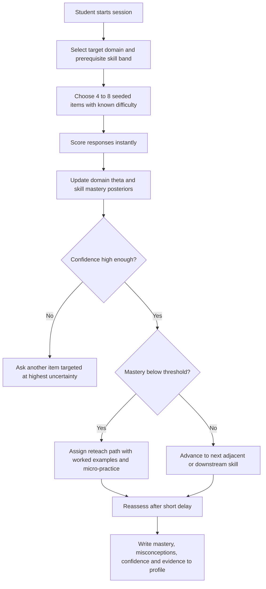
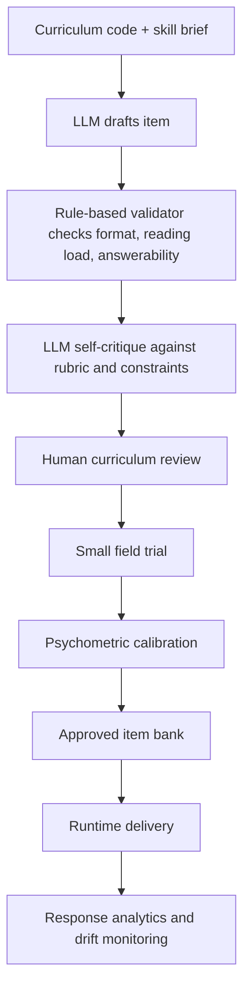
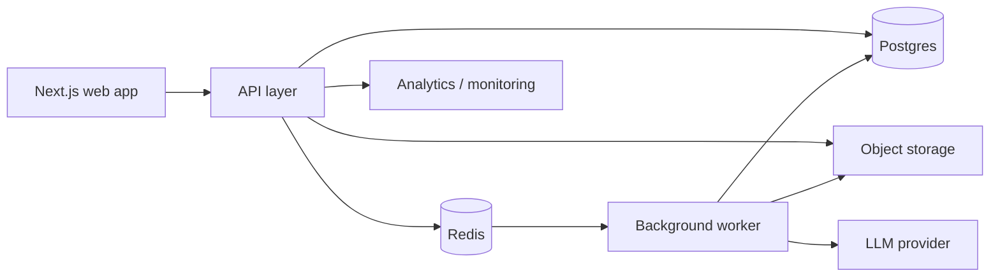

# Intelligence Report on NAPLAN for an AI Gap-Detection and Adaptive Learning System for Prep–Year 7

## Executive summary

NAPLAN is a national, summative literacy and numeracy assessment for students in Years 3, 5, 7 and 9. It is administered within the National Assessment Program, developed and centrally managed by entity["organization","ACARA","australian edu authority"], and implemented in each jurisdiction by test administration authorities. In 2026 the test window ran from 11 to 23 March; schools are expected to schedule tests as early as possible in that 9-day window, and Year 3 writing remains paper-based while most other tests are online. citeturn3search10turn1search6turn1search9turn40search11

For your product, the most important design reality is that NAPLAN is **not** a curriculum-complete scope-and-sequence for Prep–Year 7. Officially, NAPLAN assesses what students have demonstrated in key aspects of the Australian Curriculum, and most questions are based on knowledge and skills taught in previous years; only a small number of items extend into the year of testing and, in some cases, the following year. That means a serious Prep–Year 7 platform should treat NAPLAN as the **visible benchmark layer**, but build the actual diagnostic engine on finer-grained curriculum precursors from Foundation onward. citeturn10view0turn30view0turn9view0

Since 2023, NAPLAN reports have used 4 proficiency levels — Exceeding, Strong, Developing and Needs additional support — instead of the old 10-band structure and national minimum standards. The measurement scales were reset in 2023, so results from 2023 onward are comparable with each other, but not directly with 2008–2022 reports. For a product UI, this means you should expose **unofficial projected proficiency probabilities** and **skill mastery evidence**, but you should not mimic historical band reporting for current cohorts. citeturn34view0turn8view2turn33view0turn32view0

The official framework already points to the right technical shape for an AI learning system: online tests other than writing use a multistage tailored design; student reporting uses weighted likelihood estimates for student- and school-level reporting, while national analyses use plausible values; writing is rubric-based with 10 criteria and human quality assurance, supported by equating and pairwise verification across years. In practice, your platform should mirror this with a dual model: a **domain-level latent ability model** for comparability and a **micro-skill mastery graph** for teaching decisions. citeturn8view0turn8view1turn38view2turn38view3turn36view4turn39view0

The product opportunity is strongest if you position the system as a **teacher-and-parent-facing diagnostic intervention layer**, not a “NAPLAN crammer”. Concretely, that means: an ontology keyed to curriculum descriptor codes and NAPLAN strands; robust item tagging for misconceptions, item format, time demand and distractors; human-reviewed LLM-assisted item generation; a privacy model aligned to the Privacy Act and Australian Privacy Principles; and a deployment architecture that keeps student records in Postgres, task queues out of the web request path, and any vector search strictly supplementary rather than authoritative. citeturn41search8turn41search4turn41search0turn42search0turn42search1turn42search3turn42search5

## Official source pack

The highest-value official sources are concentrated in three places: the NAP site for frameworks, protocols, reporting guidance, sample materials and the public demonstration environment; the ACARA site for score-equivalence tables, national results and archived past papers; and the entity["organization","Department of Education","australian government"] site for the National Assessment Program overview and governance context. The Australian Curriculum site is the authoritative source for English and Mathematics achievement standards, content descriptions and work samples that you will need for curriculum mapping. citeturn3search0turn2search0turn2search1turn1search14turn2search2turn2search3

The key operational fact for content acquisition is this: **current online adaptive test forms are not released as full fixed papers**. Historical paper tests are available, especially through ACARA’s archives for 2012–2016 and related score-equivalence tables from 2009 onward, but contemporary preparation should rely on the NAP public demonstration site, the assessment framework, proficiency descriptions, writing marking guides, reading exemplars and work samples rather than expecting a full current fixed-form paper bank. citeturn2search7turn32view0turn5search8turn1search14turn34view0

The table below is the minimum official source pack I would hand to engineering, curriculum and assessment teams on day one.

| Source | What it is for | URL |
|---|---|---|
| NAPLAN assessment framework | Core design, constructs, item formats, content proportions, accessibility | `https://nap.edu.au/docs/default-source/naplan/naplan-assessment-framework.pdf` |
| What’s in the tests | Overview of Reading, Writing, Language conventions, Numeracy, plus past-paper links | `https://www.nap.edu.au/naplan/whats-in-the-tests` |
| NAP resources hub | Writing marking guides, sample prompts, reading exemplars, reporting guides | `https://www.nap.edu.au/resources` |
| Public demonstration site | Current-style online item formats and interactions | `https://nap.edu.au/naplan/public-demonstration-site` |
| NAPLAN test window | Current annual test-window information | `https://www.nap.edu.au/naplan/key-dates/naplan-test-window` |
| National protocols for test administration | Governance, timing, participation, accessibility, administration rules | `https://www.nap.edu.au/docs/default-source/naplan/naplan-national-protocols-for-test-administration.pdf` |
| Proficiency level descriptions | Current skill descriptions by domain, year and proficiency level | `https://www.nap.edu.au/naplan/results-and-reports/proficiency-level-descriptions` |
| NAPLAN results 2008–2022 | Historic bands, scales, national minimum standards and old report interpretation | `https://www.nap.edu.au/naplan/results-and-reports/naplan-results-2008-2022` |
| National minimum standards | Historic minimum-standard descriptions by domain and year | `https://www.nap.edu.au/naplan/whats-in-the-tests/national-minimum-standards` |
| NAPLAN score equivalence tables | Raw-score-to-scale conversions for paper tests; reporting transition notes | `https://www.acara.edu.au/assessment/naplan/naplan-score-equivalence-tables` |
| Past paper archive | Historical fixed-form papers and magazines | `https://www.acara.edu.au/assessment/naplan/naplan-2012-2016-test-papers` |
| National Assessment Program overview | Federal governance context | `https://www.education.gov.au/national-assessment-program` |
| NAPLAN page on Education site | Program summary and domain definitions | `https://www.education.gov.au/national-assessment-program/national-assessment-program-literacy-and-numeracy` |
| Australian Curriculum English | Learning area structure and links to descriptors/work samples | `https://www.australiancurriculum.edu.au/curriculum-information/understand-this-learning-area/english` |
| Australian Curriculum Mathematics | Learning area structure and links to descriptors/work samples | `https://www.australiancurriculum.edu.au/curriculum-information/understand-this-learning-area/mathematics` |

These locations are all official and should be preferred over commercial tutoring sites, crowd-sourced PDFs and rehosted copies. For content ingestion, treat official PDFs and work-sample pages as your ground truth, and maintain source-provenance metadata down to document, page and paragraph. citeturn1search14turn2search1turn2search7turn32view0turn3search0

## Assessment architecture and reporting

NAPLAN’s purpose is broader than parent reporting. Officially, it is a nationally consistent measure of whether students are developing the essential literacy and numeracy skills needed for school and life; it is also used by teachers, schools, systems and governments to identify strengths, areas of need and broader performance trends. The framework explicitly says NAPLAN is best used as part of a balanced assessment system alongside classroom assessment, not as a substitute for teacher judgement. citeturn1search15turn40search11turn12view0turn31view1

Governance is split. ACARA has responsibility for development and central management, while each jurisdiction’s TAA is responsible for administration in that jurisdiction; principals hold local responsibility within schools. The National Testing Working Group supports advice and quality assurance on standardised administration, accessibility, writing marking and reporting. citeturn3search10turn3search4turn3search5

Cohorts are Years 3, 5, 7 and 9. Participation is expected for all students in those year levels, with adjustments available for students with disability, exemptions available in narrow circumstances, and withdrawal decisions belonging to parents or carers rather than schools. Year 3 students always complete the writing test on paper; most other students complete their tests online. Alternative formats including braille, electronic and special-print paper remain available where required. citeturn40search11turn40search1turn40search2turn31view1turn40search6turn40search0

The content model matters for your product. The framework states that NAPLAN assesses achievement across the tested years by drawing content at, above and below the year-level expectation, with the majority of items drawn from preceding curriculum years because the test is administered early in the academic year. The parent reporting guide likewise notes that most questions are based on previous years’ schooling, with a few items extending into the year of testing and the following year. This is the formal justification for a Prep–Year 7 remediation system that back-maps from Year 3, 5 and 7 outcomes into earlier precursor skills. citeturn12view0turn30view0

Current reporting is built around proficiency standards and scale scores. Individual student reports show a proficiency scale for each assessment area, the student result, the national average and the middle 60% range for the year level. Proficiency standards are set as “challenging but reasonable” expectations at the time of testing. From 2023 onward, results are reported against 4 proficiency levels and the old time series was reset. citeturn31view0turn34view0turn8view2turn32view0

For historical interpretation, older reports used 5 scales spread across 10 bands, with six bands reported at each year level and one band defining the national minimum standard: Band 2 for Year 3, Band 4 for Year 5, Band 5 for Year 7 and Band 6 for Year 9. Results from 2023 onward cannot be directly compared with 2008–2022. citeturn33view0turn33view1turn31view1

For the product, the most useful current cut-points are the 2023-onward proficiency boundaries for Years 3, 5 and 7:

| Domain | Year 3 NAS→Developing | Year 3 Developing→Strong | Year 3 Strong→Exceeding | Year 5 NAS→Developing | Year 5 Developing→Strong | Year 5 Strong→Exceeding | Year 7 NAS→Developing | Year 7 Developing→Strong | Year 7 Strong→Exceeding |
|---|---:|---:|---:|---:|---:|---:|---:|---:|---:|
| Numeracy | 311 | 378 | 493 | 386 | 451 | 577 | 431 | 500 | 632 |
| Reading | 282 | 368 | 481 | 377 | 448 | 555 | 430 | 500 | 603 |
| Writing | 296 | 370 | 503 | 385 | 455 | 570 | 439 | 511 | 614 |
| Spelling | 294 | 380 | 489 | 378 | 451 | 553 | 430 | 497 | 595 |
| Grammar and punctuation | 312 | 404 | 523 | 397 | 470 | 582 | 444 | 513 | 620 |

Source note for the table: official NAPLAN 2025 Technical Report cut-point table. These cut-points were established in 2023 and retained for subsequent years. citeturn8view3

The implication for UX is straightforward. Your product should show **skill mastery**, **confidence** and an **unofficial proficiency forecast**. It should not claim to reproduce an official NAPLAN result, and it should clearly separate “practice-domain estimate” from “official NAPLAN report”. That distinction is not just good product hygiene; it is consistent with how NAPLAN itself describes the limits of its own reports. citeturn31view0turn31view1

## Domain analysis and curriculum mapping

A strong implementation should use two mapping layers at once. The first is a **domain-level NAPLAN map** that mirrors the official constructs. The second is a **precursor curriculum map** that runs from Foundation to Year 7 and lets the system identify why a Year 5 reading weakness may actually originate in a Year 2 comprehension or word-knowledge issue. That is especially important because your age range starts in Prep, but NAPLAN itself begins only in Year 3. citeturn12view0turn30view0turn34view0

### Reading

Officially, Reading assesses the ability to locate textual information, make inferences, interpret and integrate ideas, and examine and evaluate content, language and textual elements. Reading tests primarily assess the Literacy strand of English, with a smaller focus on Language and Literature. Text types span imaginative, informative and persuasive texts, and the cognitive demand increases from Year 3 to Year 9. citeturn10view3turn11view0turn11view1

The progression is visible in both the framework and the proficiency descriptions. Year 3 emphasises direct retrieval, simple inference and basic text-picture links; Year 5 pushes into paragraph-level inference, main idea, cause and effect, and diagram purpose; Year 7 moves much further into comparing ideas and opinions, evaluating evidence, understanding audience and purpose variation, and processing more stylised language and graphics. citeturn33view1turn34view0

| Skill cluster | NAPLAN reading process | Operational year focus | Typical item format | Curriculum anchors |
|---|---|---|---|---|
| Find explicitly stated information | Locating and identifying | Year 3 baseline; still present later | Multiple-choice, hot text, text entry | Year 3 AC9E3LY05; Year 3 achievement standard/work samples |
| Build literal + inferred meaning | Integrating and interpreting | Strong in Years 3–5 | Multiple-choice, drag/drop, hot text | Year 3 AC9E3LY05; Year 5 AC9E5LY05 |
| Main idea and paragraph gist | Integrating and interpreting | Year 5 core | Multiple-choice, hot text | Year 5 AC9E5LY05; Year 5 achievement standard |
| Audience, purpose, text structure | Analysing and evaluating | Years 5–7 | Multiple-choice, matching | Year 5 achievement standard; Year 7 AC9E7LY03–05 cluster |
| Evaluate evidence / perspective | Analysing and evaluating | Year 7 advanced | Multiple-choice, short selected-response | Year 7 AC9E7LY05 and Year 7 achievement standard |

Source note for the table: official Reading process descriptions, reading content proportions, proficiency levels, and curriculum/work-sample pages. citeturn10view3turn11view0turn18search13turn19search11turn24search0turn18search17turn29search0

### Writing

Writing assesses the accurate, fluent and purposeful production of a narrative or persuasive text in Standard Australian English. Prompts are rotated across the 9-day window, and the same genre is used across year groups according to the yearly schedule; students do not choose a prompt. The framework states that the same marking guide is used across year levels within a genre, enabling vertical comparison. citeturn10view1turn6search6turn39view2

The writing rubric has 10 separate criteria. For narrative these include audience, text structure, ideas, character and setting, vocabulary, cohesion, paragraphing, sentence structure, punctuation and spelling. Persuasive writing uses the same 10-criterion architecture with persuasive-specific criteria such as persuasive devices. This rubric structure is central to your product design: it gives you a ready-made rubric layer for feedback generation, targeted revision and model-based scoring. citeturn10view2turn6search18turn6search9

The difficulty progression should be modelled less as “genre shifts” and more as **increasing control of idea development, paragraphing, cohesion, syntax, punctuation precision and spelling sophistication**. The Year 5 English work-sample page is especially useful because it gives a current v9 achievement-standard description and an aligned creating-texts descriptor that explicitly mentions visual features, text structure, text connectives, expanded noun groups, specialist vocabulary and punctuation including dialogue punctuation. The Year 7 writing work-sample page broadens that into subject matter selection and the use of literary devices and visual features for imaginative, reflective, informative, persuasive and analytical purposes. citeturn24search0turn25search0

| Writing skill | NAPLAN criterion or strand | Operational year focus | Typical evidence signal | Curriculum anchors |
|---|---|---|---|---|
| Prompt interpretation and audience control | Audience / Ideas | Years 3–7 | Relevance, voice, task fulfilment | Year 3 AC9E3LY06; Year 5 AC9E5LY06; Year 7 AC9E7LY06 |
| Narrative / persuasive structure | Text structure / Paragraphing | Years 3–7 | Orientation-body-resolution, or introduction-body-conclusion | Year 3 AC9E3LY06; Year 5 AC9E5LA03/LY06; Year 7 AC9E7LA03/LY06 |
| Cohesion and paragraph linking | Cohesion / Paragraphing | Years 5–7 | Connectives, reference chains, paragraph sequencing | Year 5 AC9E5LA04, AC9E5LY06; Year 7 AC9E7LA04, AC9E7LY06 |
| Sentence craft | Sentence structure | Years 3–7 | Simple→compound→complex→compound-complex | Year 3 AC9E3LA06–08; Year 5 AC9E5LA05; Year 7 AC9E7LA05 |
| Vocabulary precision | Vocabulary | Years 3–7 | Topic-specific and technical language | Year 3 AC9E3LA10; Year 5 AC9E5LA08; Year 7 AC9E7LA08 |
| Conventions in context | Punctuation / Spelling | Years 3–7 | Sentence boundaries, commas, dialogue punctuation, spelling patterns | Year 5 AC9E5LA09; Year 7 AC9E7LA09 and AC9E7LY08 |

Source note for the table: official writing framework, narrative/persuasive marking guides, and v9 work-sample pages. citeturn10view1turn10view2turn6search18turn6search9turn18search14turn24search0turn25search0

### Language conventions

Language conventions covers spelling, grammar and punctuation. The assessment framework is explicit about the spelling item types: audio dictation, mistake identified and mistake not identified. Grammar and punctuation items are presented through a range of item types, are aligned mainly with the Language strand of English, and are automatically machine scored. citeturn10view4turn35view0

This domain is often where the best “gap-filling” value sits, because it decomposes cleanly into teachable subskills. In product terms, you should not store this as one blended “English mechanisms” score. Store separate micro-skills such as sentence boundaries, clause agreement, verb tense consistency, apostrophes, commas, morphology, grapheme–phoneme patterns, high-frequency words and proofreading. That is more instructionally useful and also more faithful to how NAPLAN itself separates spelling from grammar and punctuation in scoring. citeturn12view0turn10view4turn32view0

| Skill cluster | NAPLAN strand | Year focus | Item type examples | Curriculum anchors |
|---|---|---|---|---|
| Dictated spelling | Spelling | Years 3–7 | Audio dictation | Word-knowledge expectations in Year 3, 5 and 7 |
| Proofreading / error repair | Spelling / Grammar / Punctuation | Years 3–7 | Mistake identified; mistake not identified; inline choice | Year 3 AC9E3LA11; Year 5 AC9E5LA09; Year 7 AC9E7LA09 |
| Clause and tense control | Grammar | Years 3–7 | Multiple-choice, gap match, inline choice | Year 3 AC9E3LA06–08; Year 5 AC9E5LA05; Year 7 AC9E7LA05–06 |
| Sentence and paragraph punctuation | Punctuation | Years 3–7 | Multiple-choice, inline choice, drag/drop | Year 5 AC9E5LA09; Year 7 AC9E7LA09 |
| Morphology and word origins | Spelling / vocabulary growth | Years 5–7 | Text entry, selected response | Year 5 phonic/morphemic expectations; Year 7 AC9E7LY08 |

Source note for the table: official conventions framework, automatic scoring notes and curriculum/work-sample material. citeturn10view4turn35view0turn24search0turn25search0

### Numeracy

Officially, Numeracy assesses students’ application of mathematics knowledge and skills in context. The framework distributes content across number, algebra, measurement, space, statistics and probability, and states that more complex pathways place relatively more weight on problem-solving and reasoning, while less complex pathways place more weight on fluency and understanding. Numeracy items are frequently contextualised and often use graphics to reduce reading load or express the mathematical demand more appropriately. citeturn10view4turn10view5turn11view3

The year-level progression is clear. Year 3 centres on place value, simple operations, fractions as equal parts, time, shape properties and basic data displays. Year 5 extends into decimals, equivalent fractions, multi-step operations, metric measurement, angles, maps and stronger data interpretation. Year 7 broadens to rational numbers, percentages, ratios, algebraic expressions, angle relationships, area and volume, classification of polygons, transformations, statistical displays and probability reasoning. citeturn34view0turn23search0turn28search0turn23search3turn26search0

| Skill cluster | NAPLAN numeracy strand | Operational year focus | Typical item types | Curriculum anchors |
|---|---|---|---|---|
| Place value and whole-number operations | Number / Algebra | Years 3–5 | Multiple-choice, text entry, drag/drop | Year 3 AC9M3N03, AC9M3A01; Year 5 achievement standard |
| Additive and multiplicative modelling | Number | Years 3–5 | Text entry, multiple-choice, graphic gap match | Year 3 AC9M3N06 |
| Fractions, decimals, percentages | Number | Years 5–7 | Multiple-choice, text entry, matching | Year 5 achievement standard; Year 7 AC9M7N06 |
| Measurement and time | Measurement | Years 3–5 | Text entry, hot spot, multiple-choice | Year 3 AC9M3M03–04; Year 5 AC9M5M04 |
| Geometry and spatial reasoning | Space / Measurement | Years 5–7 | Hot spot, matching, drag/drop | Year 5 angle and shape expectations; Year 7 AC9M7SP02, AC9M7M05 |
| Statistics and probability | Statistics / Probability | Years 5–7 | Table/graph interpretation, multiple-choice, text entry | Year 5 graph interpretation; Year 7 AC9M7ST02, AC9M7ST03, AC9M7P02 |

Source note for the table: official numeracy framework, proficiency descriptions and v9 work-sample pages. citeturn10view5turn11view3turn23search0turn28search0turn21search7turn26search0

For Prep–Year 2, the safest approach is to treat these Year 3 expectations as the **observable horizon** and then back-chain prerequisites. For example, if a Year 3 student misses additive modelling and place-value items, the root-cause graph should inspect F–2 number sequence, partitioning, subitising, regrouping and early additive reasoning before it prescribes more Year 3 practice. That is where your product can outperform ordinary NAPLAN drill tools. citeturn23search0turn10view0

## Scoring, psychometrics and diagnostic design

NAPLAN’s online tests other than writing use a multistage tailored design. Students begin with an initial testlet and then branch into easier or harder subsequent testlets based on performance. Importantly, the score depends on both the number of correct answers and the difficulty of the pathway. That is why score-equivalence tables are published only for paper tests and not for online tests generally. citeturn8view0turn8view1turn32view0

Scoring is mixed by domain. Reading, spelling, grammar and punctuation are automatically scored, with the framework explicitly noting machine scoring for spelling and for the grammar-and-punctuation section. Writing is analytic-criterion scored using the rubric and exemplar scripts. In 2025, writing quality assurance included daily control scripts, cross-jurisdiction reporting and check-marking for every marker, with at least 10% of scripts covered by expert back-marking under the national protocols. citeturn35view0turn10view2turn37view1

Under the hood, NAPLAN 2025 used Rasch-family modelling. The technical report states that the non-writing domains were calibrated using item response modelling and that writing criteria were calibrated concurrently across Years 3, 5, 7 and 9 using the partial credit model, creating a vertical writing scale. Student- and school-level reporting uses weighted likelihood estimates, while national statistics use 5 plausible values per student because WLEs are not ideal for population estimates. citeturn38view0turn38view1turn38view2turn38view3

Equating remains critical even after the 2023 reset. For non-writing domains, yearly results are equated through linked items; for writing, the authority uses anchoring plus a pairwise equating verification study to test year-on-year consistency of rubric marking. The 2025 pairwise study found high comparability between 2023 and 2025 writing scales, and the overall correlation between pairwise and rubric locations was 0.947. Test reliabilities in 2025 were strong overall, with reading around 0.89–0.91 WLE reliability, numeracy around 0.90–0.94, and writing at 0.96 WLE reliability. citeturn35view2turn37view3turn39view0turn39view3

For your system, the most defensible diagnostic design is a **three-layer model**:

1. **Domain latent score** for Reading, Writing, Spelling, Grammar/Punctuation and Numeracy.  
2. **Skill-graph mastery** for fine-grained curriculum nodes and misconceptions.  
3. **Session-state model** for short-term readiness, fatigue and confidence.

This mirrors NAPLAN’s own distinction between broad reporting scales and finer-grained item evidence. The latent-score layer should use a Rasch or 2PL family depending on your item-bank maturity; early on, Rasch/PCM is often preferable because it is easier to maintain and explain, and it is closer to NAPLAN’s own operational measurement approach. If you build a large, heavily trialled bank with stable discrimination estimates, a 2PL layer can be added later for internal adaptivity. That is an engineering recommendation inferred from the official psychometric design. citeturn38view1turn38view2turn38view3turn8view0

A practical mastery policy is:

- **Mastered**: posterior mastery ≥ 0.80 and confidence interval sufficiently narrow.  
- **Borderline**: 0.60–0.79 or confidence still wide.  
- **Needs reteach**: < 0.60, or repeated misconception evidence.  
- **Escalate**: if latent domain trend is down, even while single-skill scores look acceptable.

Those thresholds are not official NAPLAN thresholds; they are product thresholds for formative decision-making and should be presented as such. The official proficiency cut-points should be used only for **unofficial probability-of-level** projections at the domain layer. citeturn8view3turn31view0



The data you persist after each response should support both psychometrics and teaching:

```python
# illustrative pseudocode
def update_after_response(student, item, response):
    score = auto_or_human_score(item, response)

    theta_post = update_irt_theta(
        theta_prior=student.domain_theta[item.domain],
        item_params=item.irt,
        score=score
    )

    mastery_post = update_skill_mastery(
        prior=student.skill_mastery[item.skill_id],
        score=score,
        misconception=item.detect_misconception(response),
        slip=item.slip,
        guess=item.guess
    )

    student.domain_theta[item.domain] = theta_post.mean
    student.domain_se[item.domain] = theta_post.sd
    student.skill_mastery[item.skill_id] = mastery_post.mean
    student.skill_se[item.skill_id] = mastery_post.sd

    if mastery_post.mean < 0.60:
        route = "reteach"
    elif mastery_post.sd > 0.20:
        route = "probe_more"
    else:
        route = "advance"

    return {
        "score": score,
        "route": route,
        "theta": theta_post.mean,
        "theta_se": theta_post.sd,
        "mastery": mastery_post.mean,
        "mastery_se": mastery_post.sd
    }
```

### Question taxonomy and ontology

The official framework gives you the raw ingredients for a rigorous tagging schema: reading cognitive processes; numeracy strands and calculation demand; conventions item types; QTI item formats; writing rubric criteria. Your ontology should extend those with pedagogy-friendly fields such as misconception family, instructional dependency, distractor rationale and expected time-on-task. citeturn10view3turn10view4turn10view5turn11view2turn11view3

Recommended top-level tags:

| Field | Purpose |
|---|---|
| `domain` | reading / writing / spelling / grammar_punctuation / numeracy |
| `naplan_year_target` | 3 / 5 / 7 |
| `curriculum_code` | e.g. AC9E5LY06, AC9M7N06 |
| `skill_id` | internal micro-skill node |
| `skill_family` | inference, fractions, tense, punctuation, etc. |
| `cognitive_process` | locate, infer, analyse, fluency, reasoning, problem_solving |
| `stimulus_type` | narrative_text, informative_text, table, chart, diagram, prompt |
| `response_format` | MCQ, multi_select, hot_text, drag_drop, inline_choice, text_entry, extended_text |
| `calculator_policy` | none / inactive / active / neutral |
| `read_aloud_policy` | allowed / partial / not_applicable |
| `time_expected_sec` | calibration and pacing |
| `difficulty_b` | IRT difficulty |
| `discrimination_a` | optional; internal only if 2PL/3PL used |
| `misconception_code` | e.g. frac_denominator_addition |
| `distractor_map` | option-level misconception links |
| `rubric_criterion` | for writing only |
| `provenance` | source, author, reviewer, approval status |
| `safety_flags` | age appropriateness, bias review, sensitive-topic review |

A machine-readable example:

```json
{
  "item_id": "num_y5_frac_0142",
  "domain": "numeracy",
  "naplan_year_target": 5,
  "curriculum_code": "AC9M5N06",
  "skill_id": "fractions.equivalence.add_sub_related_denominators",
  "skill_family": "fractions",
  "cognitive_process": "problem_solving",
  "stimulus_type": "word_problem_with_diagram",
  "response_format": "multiple_choice",
  "calculator_policy": "inactive",
  "time_expected_sec": 75,
  "difficulty_b": 0.42,
  "misconception_code": "adds_numerators_and_denominators",
  "distractor_map": {
    "A": "correct",
    "B": "adds_numerators_and_denominators",
    "C": "treats_denominators_as_wholes_only",
    "D": "chooses_visual_not_numeric_match"
  },
  "prerequisites": [
    "fractions.unit_fractions",
    "fractions.equal_parts",
    "number.addition_basic"
  ],
  "mastery_threshold": 0.8,
  "source": {
    "origin": "internal_generated_human_reviewed",
    "review_status": "approved",
    "reviewer_role": "curriculum_editor"
  }
}
```

## Data model, AI integration and delivery stack

### Data requirements and Postgres schema

Your core database should be relational. The authoritative record needs clean joins between students, families, schools, curriculum nodes, items, responses, mastery states and audit trails. Postgres is the right default here because the data is relational first and vector-search second. That also fits the official product direction you described around entity["company","Railway","cloud hosting platform"], whose documentation supports straightforward Next.js + Postgres deployments and first-class database services. citeturn42search0turn42search1turn42search3

A workable schema is below.

| Table | Key columns | Notes |
|---|---|---|
| `users` | `id`, `role`, `email`, `phone`, `status` | parent, teacher, school_admin, tutor |
| `students` | `id`, `school_id`, `first_name`, `dob`, `year_level`, `consent_status` | store minimum necessary identifiers |
| `student_guardians` | `student_id`, `user_id`, `relationship`, `permissions` | parent/carer control layer |
| `schools` | `id`, `name`, `sector`, `state`, `taa_jurisdiction` | school or homeschool/cohort grouping |
| `curriculum_nodes` | `id`, `code`, `learning_area`, `year_band`, `description` | Australian Curriculum anchor |
| `skills` | `id`, `parent_skill_id`, `domain`, `name`, `description` | internal micro-skill graph |
| `skill_curriculum_map` | `skill_id`, `curriculum_node_id`, `weight` | many-to-many alignment |
| `items` | `id`, `domain`, `year_target`, `format`, `prompt`, `stimulus_ref`, `difficulty_b`, `status` | item bank |
| `item_tags` | `item_id`, `skill_id`, `cognitive_process`, `misconception_code`, `stimulus_type`, `calculator_policy` | diagnostic metadata |
| `item_options` | `id`, `item_id`, `label`, `content`, `is_correct`, `misconception_code` | distractor analysis |
| `attempts` | `id`, `student_id`, `session_id`, `item_id`, `response_payload`, `score`, `latency_ms`, `device_type`, `created_at` | response log |
| `writing_scores` | `attempt_id`, `criterion`, `score`, `rater_type`, `rater_id`, `confidence` | analytic writing scoring |
| `sessions` | `id`, `student_id`, `goal`, `mode`, `started_at`, `ended_at` | diagnostic, practice, reassessment |
| `mastery_states` | `student_id`, `skill_id`, `mastery_mean`, `mastery_se`, `evidence_n`, `last_updated_at` | skill mastery store |
| `domain_states` | `student_id`, `domain`, `theta`, `theta_se`, `projected_proficiency`, `updated_at` | broad domain estimate |
| `interventions` | `id`, `student_id`, `skill_id`, `assigned_path`, `reason`, `owner`, `due_at` | human + system action log |
| `content_reviews` | `id`, `item_id`, `review_type`, `review_status`, `reviewer`, `notes` | editorial and safety approval |
| `audit_events` | `id`, `actor_id`, `entity_type`, `entity_id`, `action`, `metadata`, `created_at` | compliance and debugging |

Use strict foreign keys, immutable response logs, soft deletes for user-facing content, and explicit versioning for item revisions so that psychometric histories remain reproducible. For every modelled score, persist both the mean estimate and uncertainty. This follows the spirit of the official reporting distinction between point estimates and population reporting uncertainties. citeturn38view2turn38view3

### AI integration

The safest high-value uses of LLMs in this product are not “grade everything freely”; they are **bounded generation and bounded explanation**. Recommended AI use cases:

- generate first drafts of practice items from a curriculum code + skill brief  
- generate distractors tied to documented misconceptions  
- rewrite text passages to a target complexity band  
- scaffold feedback explanations at multiple reading ages  
- summarise a student’s evidence trail for a parent or teacher  
- support writing feedback against rubric criteria, but keep a human-review loop for any score that would be surfaced as consequential.

This is aligned with the official assessment design, which depends on constrained item formats, criterion-referenced writing rubrics and curriculum-linked skill descriptions, rather than unconstrained generative content. citeturn11view2turn10view2turn34view0

A strong AI content pipeline looks like this:



Recommended generation prompt skeleton:

```text
System:
You are an assessment item writer for Australian primary years.
Follow the supplied curriculum code, NAPLAN domain, year target, and item-format constraints exactly.
Do not introduce content outside the specified skill.

User:
Generate 1 Year 5 numeracy item aligned to AC9M5N06.
NAPLAN domain: Numeracy
Cognitive demand: problem solving
Format: multiple choice with 4 options
Reading load: low
Must test: fraction/decimal/percentage equivalence in context
Must include:
- correct answer
- 3 distractors, each tied to a distinct misconception
- concise worked explanation
- metadata tags
Return JSON only.
```

Recommended acceptance gates before any generated item becomes live:

| Gate | Requirement |
|---|---|
| Curriculum validity | Explicit alignment to descriptor code and target year |
| Answerability | Single unambiguous key; no hidden assumptions |
| Difficulty fit | Expected year-appropriate reading load and mathematical/linguistic demand |
| Misconception tagging | Distractors map cleanly to plausible errors |
| Safety | No harmful, discriminatory, frightening or age-inappropriate content |
| Bias review | Contexts do not advantage a narrow cultural or socio-economic profile |
| Accessibility | Compatible with read-aloud, keyboard use and contrast rules where relevant |
| Trial quality | Sufficient field-test evidence before high-stakes adaptation logic uses it |

For writing, I would not allow an LLM to act as the final scorer for consequential outputs shown as “score”. A better pattern is: rubric-aligned analytic suggestions, confidence estimation, and escalation to human review when confidence is low or when results drive important interventions. That is consistent with NAPLAN’s continued human quality assurance and cross-year writing verification. citeturn37view1turn35view2

### Railway and Next.js delivery plan

The official platform documentation supports a clean baseline architecture for a Next.js application with Postgres on Railway, including standalone Next.js builds, managed PostgreSQL, Redis and persistent volumes where needed. Railway’s data and storage docs also make clear that persistent storage belongs on databases, volumes and object storage, not in ephemeral app containers. citeturn42search0turn42search1turn42search3turn42search5turn42search12turn42search16

Recommended stack on Railway:

| Service | Recommendation | Why |
|---|---|---|
| Web app | Next.js app in standalone mode | SSR, app router, APIs, admin UI |
| API / backend | Same repo or separate Node service | Keeps long-running background tasks away from request path |
| Primary DB | Railway Postgres | authoritative student, item and mastery data |
| Cache / queues | Redis | session cache, rate limits, background jobs, AI generation queue |
| Worker | Separate background worker service | calibration jobs, batch mastery recompute, content generation |
| Object store | S3-compatible bucket | stimuli, generated artefacts, reports, exports |
| Vector DB | Optional, only for retrieval | useful for passage retrieval and knowledge-base search, not for core scoring |
| Observability | structured logs + event table | audit, prompt tracing, model drift and incident response |

Suggested deployment topology:



Operational notes for this stack:

- keep Postgres as the source of truth for all academic state  
- use Redis for queues, temporary session state and expensive-response caching  
- keep vector search optional and non-authoritative  
- store prompts, LLM outputs, review status and safety flags in relational tables  
- separate “student-facing explanation generation” from “content-authoring generation” so you can enforce stricter guardrails in each path  
- run psychometric calibration and large exports in the worker, not in the web tier  
- mount persistent volumes only for services that truly need filesystem persistence; do not rely on the app container filesystem for durable data. citeturn42search0turn42search2turn42search3turn42search5turn42search12turn42search16

## Privacy, compliance and accessibility

Australia does not have a single school-data law that maps one-to-one onto FERPA. The closest federal baseline is the Privacy Act 1988 and the Australian Privacy Principles, which govern transparency, collection, use, disclosure, cross-border handling, security and access rights for covered entities. For a student-data product, the most relevant APPs operationally are APP 1 on transparent privacy management, APP 8 on cross-border disclosure and APP 11 on security. citeturn41search1turn41search8turn41search0turn41search4turn41search3

That has direct product consequences. If any student personal information is processed by an overseas model provider, the APP 8 cross-border obligations become live. If you keep any identifiable student data, APP 11 requires reasonable steps to protect it from misuse, interference, loss and unauthorised access, modification or disclosure. In commercial terms: data minimisation, parent/school consent workflows, clear role-based access control, encryption at rest and in transit, retention rules, deletion workflows and a breach-response runbook are mandatory baseline controls, not “nice to have” features. citeturn41search0turn41search4turn41search12

Accessibility is not optional. The NAPLAN framework itself references WCAG alignment for digital access, and the NAPLAN accessibility pages emphasise equivalent learner experience, reasonable adjustments and maximum participation. The broader statutory backbone is the Disability Discrimination Act 1992 and the Disability Standards for Education 2005. Your platform should therefore support keyboard navigation, read-aloud where appropriate, colour-safe contrast, font/zoom controls, simplified layouts, alternative representations and documented accommodation settings at the learner profile level. citeturn10view0turn40search0turn40search4turn41search2turn41search6

Bias mitigation should be treated as an assessment-quality problem, not only a policy problem. In practice that means reviewing contexts, names, topics, idioms, assumed background knowledge, image dependence, reading load and regional vocabulary. You should also monitor differential performance by subgroup after deployment, not just during item review. NAPLAN itself uses quality assurance, item trialling and psychometric review to establish fairness and validity; your product should adopt the same discipline. citeturn11view2turn12view2turn39view0

Recommended compliance posture:

- parent/carer as default controller for home use  
- school-controlled tenant for school deployments  
- least-privilege access by role  
- de-identify analytics whenever operationally possible  
- never send full student profiles to an LLM if a smaller task-specific prompt will do  
- keep writing exemplars and reports auditable back to source prompts and scoring logic  
- obtain legal review before any production deployment into government-school procurement.

Those last points are implementation recommendations, but they follow directly from the APP and accessibility obligations above. citeturn41search8turn41search4turn40search0

## Evaluation, rollout and appendices

Your evaluation plan should separate **feasibility**, **instructional efficacy** and **NAPLAN transfer**. The official reporting guides repeatedly stress that NAPLAN is only one part of assessment and should be interpreted alongside teacher judgement. Accordingly, your pilots should track both classroom outcomes and NAPLAN-aligned outcomes rather than treating one as a substitute for the other. citeturn31view0turn31view1turn12view0

A good metric stack is:

| Layer | Metrics |
|---|---|
| Product usage | completion rate, session length, return rate, teacher assignment rate |
| Diagnostic quality | posterior uncertainty reduction, skill-classification agreement, misconception precision |
| Instructional effect | skill mastery gain, time-to-mastery, review-to-retention ratio |
| Transfer | improvement on held-out NAPLAN-style items and proficiency forecasts |
| Safety and quality | item rejection rate, hallucination catch rate, explanation complaint rate, bias flags |
| Trust | parent satisfaction, teacher override rate, recommendation acceptance rate |

For pilot design, I would use three phases:

- **Feasibility pilot**: 60–120 students, mainly to test onboarding, content quality and telemetry integrity.  
- **Efficacy pilot**: 300–800 students across multiple schools or classes, with teacher-as-usual comparison.  
- **Transfer study**: one full term or more, linked to pre/post NAPLAN-style benchmark forms and, where available, later official reports.

Those are recommended operating heuristics rather than official requirements, but they are realistic for a school-edtech rollout where moderate effects need to be detectable and subgroup analyses matter.

### Engineer handoff checklist

- confirm source-of-truth document set and snapshot official versions  
- lock ontology fields and item-tag schema  
- build curriculum graph from Foundation to Year 7 with NAPLAN overlay  
- define `mastery_states` and `domain_states` update contracts  
- separate production item bank from draft/generated item pool  
- implement human review workflow for all generated items  
- build response-event logging before shipping adaptation logic  
- add confidence intervals everywhere a diagnostic judgement is shown  
- label all NAPLAN-like outputs as unofficial projections unless sourced from actual reports  
- implement privacy consent, deletion and audit workflows before pilot launch  
- add accommodation settings at user and item level  
- create benchmark forms for internal pre/post studies  
- document model cards for scoring and recommendation models  
- create incident runbooks for content safety, data breach and scoring anomalies

### Primary document appendix

| Document | URL |
|---|---|
| NAPLAN assessment framework | `https://nap.edu.au/docs/default-source/naplan/naplan-assessment-framework.pdf` |
| NAPLAN technical report 2025 | `https://www.nap.edu.au/docs/default-source/naplan/naplan-2025-technical-report.pdf` |
| NAPLAN resources hub | `https://www.nap.edu.au/resources` |
| What’s in the tests | `https://www.nap.edu.au/naplan/whats-in-the-tests` |
| Public demonstration site | `https://nap.edu.au/naplan/public-demonstration-site` |
| Proficiency level descriptions | `https://www.nap.edu.au/naplan/results-and-reports/proficiency-level-descriptions` |
| NAPLAN results 2008–2022 | `https://www.nap.edu.au/naplan/results-and-reports/naplan-results-2008-2022` |
| National minimum standards | `https://www.nap.edu.au/naplan/whats-in-the-tests/national-minimum-standards` |
| National protocols for test administration | `https://www.nap.edu.au/docs/default-source/naplan/naplan-national-protocols-for-test-administration.pdf` |
| NAPLAN score equivalence tables | `https://www.acara.edu.au/assessment/naplan/naplan-score-equivalence-tables` |
| Past papers archive | `https://www.acara.edu.au/assessment/naplan/naplan-2012-2016-test-papers` |
| National Assessment Program overview | `https://www.education.gov.au/national-assessment-program` |
| NAPLAN overview on Education site | `https://www.education.gov.au/national-assessment-program/national-assessment-program-literacy-and-numeracy` |
| Australian Curriculum English | `https://www.australiancurriculum.edu.au/curriculum-information/understand-this-learning-area/english` |
| Australian Curriculum Mathematics | `https://www.australiancurriculum.edu.au/curriculum-information/understand-this-learning-area/mathematics` |
| Privacy Act 1988 | `https://www.legislation.gov.au/C2004A03712/2024-12-11/2024-12-11/text/original/pdf` |
| Australian Privacy Principles | `https://www.oaic.gov.au/privacy/australian-privacy-principles` |
| APP 8 guidance | `https://www.oaic.gov.au/privacy/australian-privacy-principles/australian-privacy-principles-guidelines/chapter-8-app-8-cross-border-disclosure-of-personal-information` |
| APP 11 guidance | `https://www.oaic.gov.au/privacy/australian-privacy-principles/australian-privacy-principles-guidelines/chapter-11-app-11-security-of-personal-information` |
| Disability Standards for Education 2005 | `https://www.legislation.gov.au/Details/F2005L00767` |
| NAPLAN accessibility | `https://www.nap.edu.au/naplan/accessibility` |

### Final product position

The strongest way to build this product is to treat NAPLAN as the **reporting and benchmarking shell**, and the Australian Curriculum as the **instructional spine**. If you build the system that way, you get something much more valuable than a practice app: a defensible diagnostic engine that can detect gaps below the visible NAPLAN symptom, prescribe the next teachable step, and still speak the language parents and schools already understand. citeturn10view0turn2search1turn34view0turn31view1